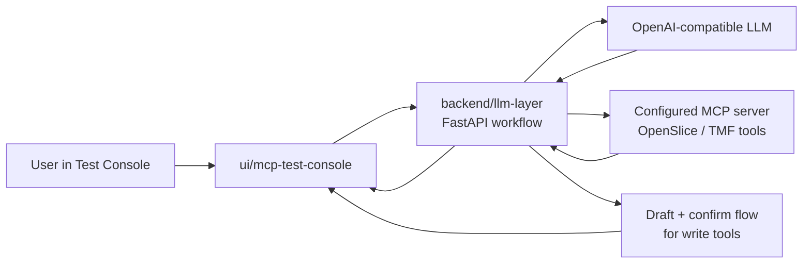

# COP-PILOT LLM Layer

This repository contains the current LLM layer used to test a product-focused MCP workflow.

The maintained runtime has two parts:

- `backend/llm-layer`: FastAPI service that calls an LLM and an MCP server.
- `ui/mcp-test-console`: Vue console for manual end-to-end checks.

Removed legacy modules are not part of the supported path. If you are changing behavior, start in one of the two directories above.

## Simple Diagram



## What The Backend Does

The API accepts chat messages and lets the model call configured MCP tools. Product discovery tools run immediately. Product-order tools are intercepted, normalized into a draft, and executed only after the client confirms the draft.

The write path is intentionally conservative:

- product-order writes return `needs_confirmation`
- duplicate confirmations are blocked
- write-tool execution is never retried automatically

The local guardrail implementation sits behind an interface so it can be replaced later without changing the HTTP contract.

## Request Flow

1. `POST /v1/chat` receives a user message.
2. The model may answer directly or request MCP tool calls.
3. Read tools run against the configured MCP server.
4. Write tools become a draft and return `needs_confirmation`.
5. The UI or client calls `POST /v1/chat/{thread_id}/confirm`.
6. The backend rechecks authorization/idempotency and executes the write tool once.

## Run Locally

Backend:

```bash
cd backend/llm-layer
poetry install
cp .env.example .env
poetry run uvicorn app.main:app --host 0.0.0.0 --port 8010 --reload
```

Frontend:

```bash
cd ui/mcp-test-console
npm ci
cp .env.example .env
npm run dev
```

Open the UI at `http://localhost:4173`.

## Verify Changes

Backend:

```bash
cd backend/llm-layer
poetry run python -m pytest -q
poetry build
docker build -t llm-layer:local .
```

Frontend:

```bash
cd ui/mcp-test-console
npm run typecheck
npm run build
docker build -t llm-layer-mcp-test-console:local .
```

## Configuration Rules

- Keep backend runtime values in `backend/llm-layer/.env`.
- Keep frontend target values in `ui/mcp-test-console/.env`.
- Do not commit secrets or real API keys.
- `MCP_SERVER_URL` is required for `streamable_http` and `sse` transports.
- `MCP_SERVER_COMMAND` is required for `stdio` transport.
- `PRODUCT_READ_TOOL_NAMES` and `PRODUCT_WRITE_TOOL_NAMES` define the execution policy.

## Useful Docs

- [backend/llm-layer/README.md](backend/llm-layer/README.md)
- [ui/mcp-test-console/README.md](ui/mcp-test-console/README.md)
- [docs/local-development.md](docs/local-development.md)
- [docs/configuration.md](docs/configuration.md)
- [docs/api-reference.md](docs/api-reference.md)
- [docs/deployment.md](docs/deployment.md)
